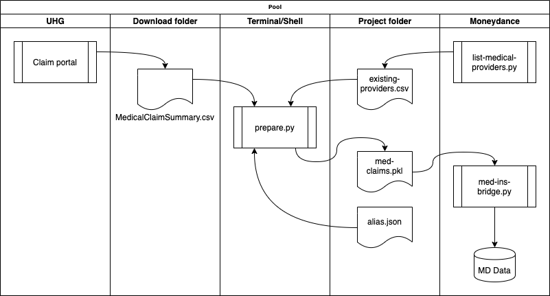

## Import UHC claims data from csv

United health care lets you download claims data. We use the default name `MedicalClaimSummary.csv` for that data.

These utilities read that data and create transactions in Moneydance in the providers accounts.



There are 3 python programs, two of which run in Moneydance in the "MoneyBot Console".  

###Moneydance Set-up and Conventions

The expectation is that each medical provider has a liability account, which is named identically to the name that UHG uses.  A provision is made for aliases, though.  These are expected to be sub-accounts of "Medical Providers".  Each of these accounts has a special comment (the only field available) to help the program set the correct category. In order to know the category to use, data is captured on the first row of the comment field of each provider

The first row of that field should contain the full category path and the non-unique part of the final element. So `X:Health:Maj-med:Tests:Test` is used for a test vendor such as Quest.  The program adds the last bit which is one of 'chg', 'ins adj' or 'ins pmt'.

### Valid bases

X:Health:Maj-med:Tests:Test  <br/>X:Health:Maj-med:Doctor:MD<br/>X:Health:Maj-med:Drugs:Rx<br/>X:Health:Dentist:DDS<br/>X:Health:Vision:Lens

### Steps

1. Remove `MedicalClaimSummary.csv` from the Downloads folder. So that browser does not add `(1)`. 

2. Inspect the file `last_processed.json`. It stores the processing dates from the last time the prepare.py ran for an account.  If it seems right, proceed, otherwise change it.  This will be used to filter the downloaded items. 

3. Download from he UHG claims portal.  Got to the Claims and Accounts -> Claims. Use the ability to create a filtered set of claims.   It will be named: `MedicalClaimSummary.csv`.   

   1. To select only certain dates it filter on the website by date (its the service date)
   2. Note - the download bottom is at the bottom of the claims page.
   3. Don't edit the file with Excel - the claim numbers get represented as exponential notation as excel saves them that way.  

4. Display the list of providers downloaded with 

   ```bash
   ./dl_providers
   ```

6. To prepare the list of providers currently in Moneydance, run `list-medical-providers.py` inside moneydance.  This puts a csv file in the working directory.

5. Ensure references to providers are clean.  Note: the downloaded values are converted to upper case before processing.  Either:

   1. Add any needed accounts in Moneydance
   2. Add aliases to `alias.json`. If the provider in the download is found in the `JSON` keys then it will be replace by its value during processing by `prepare.py`

7. The main program is `prepare.py`. It is invoked with the name of the account to process (I use the account owners initials). It looks for its input file in the Downloads folder and the provider list in the current directory.  It verifies that the providers match before writing the .pkl file. Ignores generic vendor, 'PHARMACY' and in process claims. It will display 

```
Using claims file: MedicalClaimSummary.csv
Ignoring claims on or before 2021-03-19
  Claim_Number     Patient_Name Date_Visited  ... You_Owe Flagged_To_Watch Marked_as_Paid
7   CM04209725  George Dobbs Ii   2021-02-17  ...   87.19            False          False
1   CP75227928  George Dobbs Ii   2021-03-08  ...  231.40            False          False

[2 rows x 18 columns]
6 records written to /Users/george/argus/med-ins/med-claims.pkl
```

8. Back in Moneydance run `med-ins-bridge.py`


### Aliases

The JSON file `alias.json` lists invalid provider names that need to be translated.  This allows for practice particpants to be mapped to a central billing entity as well has cases where the insurer has the name wrong.

## To Do
1. Fix: prepare.py:37: FutureWarning: The default value of regex will change from True to False in a future version. In addition, single character regular expressions will *not* be treated as literal strings when regex=True.
     claims[col] = claims[col].str.replace(r'$', '').str.replace(r',', '').astype(float)